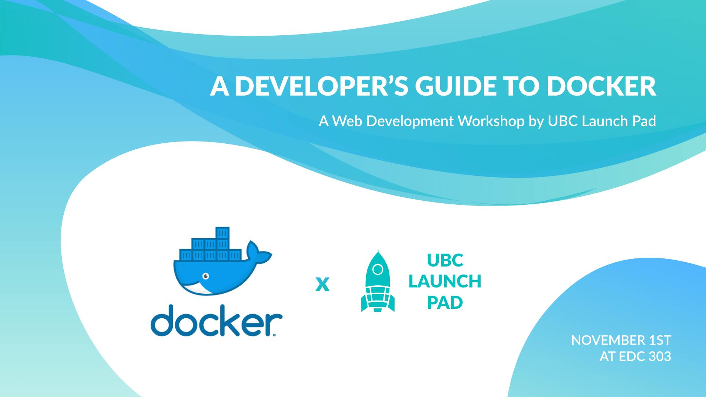

[](#)

Docker is a containerization system that keeps your application’s running
environment safe, simple, and consistent on all platforms, making development
and deployment a breeze. This repo contains the workshop component of the
presentation, where we walk through how to set up Docker configurations for
development and distribution.

- Facebook event: https://www.facebook.com/events/276016843042664/ 
- Slideshow: https://slides.ubclaunchpad.com/workshops/guide-to-docker
- Presenters: [@bfbachmann](https://github.com/bfbachmann), [@bobheadxi](https://github.com/bobheadxi)

This project was bootstrapped with [Create React App](https://github.com/facebook/create-react-app).

## Workshop Tasks

To get started, clone this repository by running the following commands in a
directory of your choice:

```sh
git clone https://github.com/ubclaunchpad/workshop-guide-to-docker.git
cd workshop-guide-to-docker
```

Have a look at the example Dockerfile provided (`demo.Dockerfile`). You can
build an `image` from it with the following command:

```sh
docker build -f demo.Dockerfile -t my-app .
```

Then, create a `container` using the `image` you built and run it:

```sh
docker run --rm -it -p 8000:8000 my-app
```

You can then browse the directory contents of your image by visiting the site
at the exposed port: http://localhost:8000/

### Part 1: Docker for Development

Coming soon!

### Part 2: Docker for Distribution

Coming soon!
